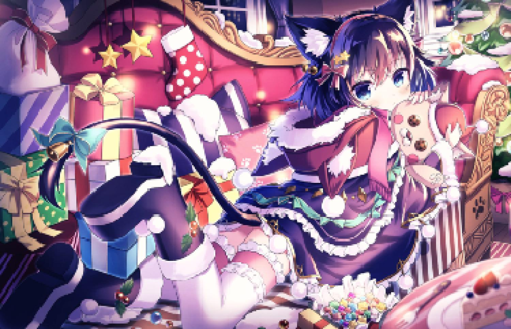
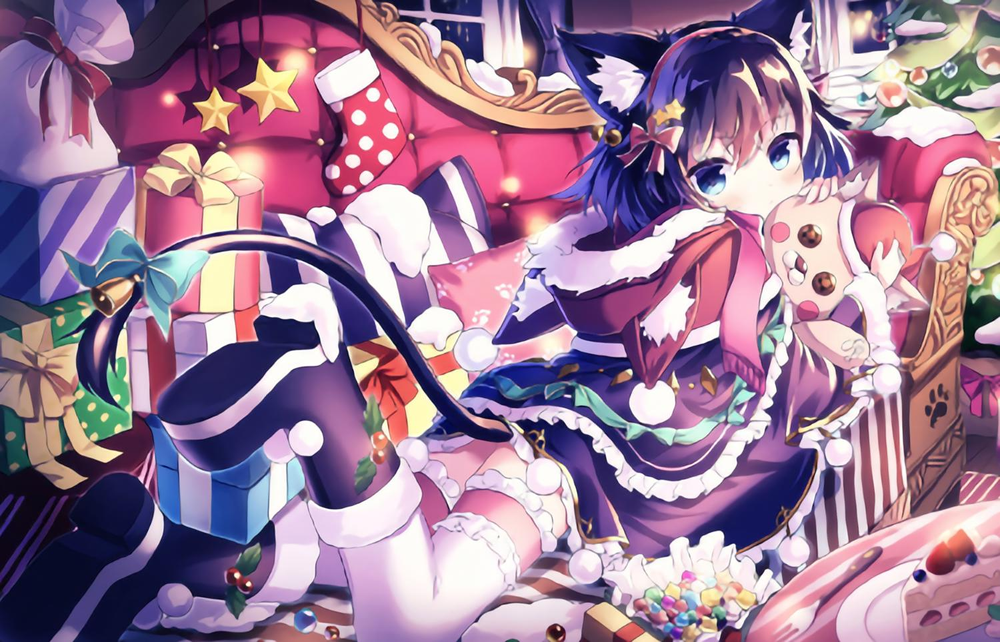
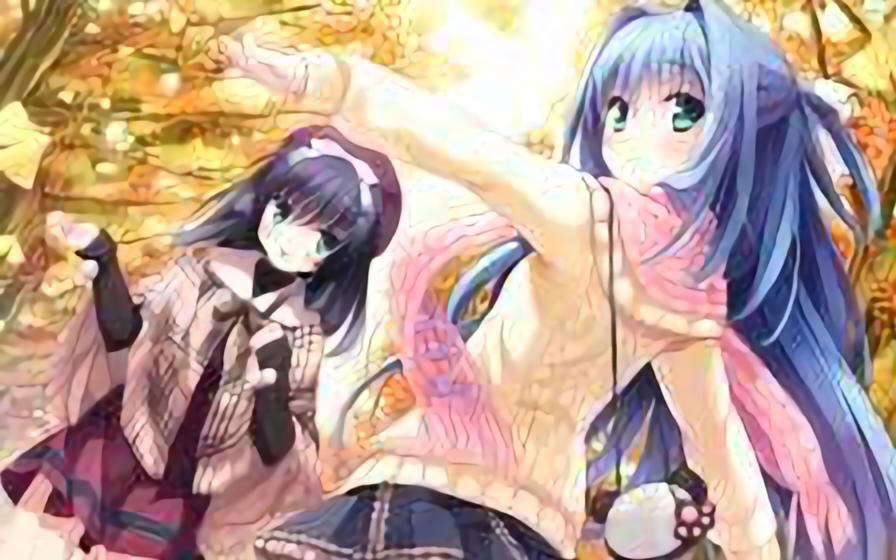
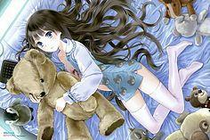
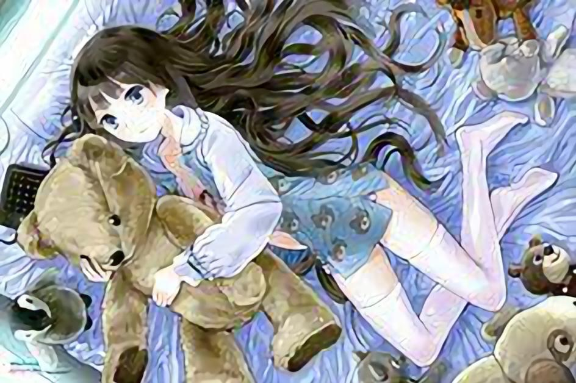

# Anime-Super-Resolution
动漫图片超分辨率——基于WDSR (2019-4-30)
#### 实现动漫图片4倍的图片放大及超分辨率

- utils.py -- 图像降采样与数据导入
- model.py -- wdsr模型
- optimizer.py -- 权重归一化Adam优化器
- train.py -- 模型训练
- predict.py -- 测试集预测
- evaluate.py -- 在不同难度等级下测试网络表现

#### 图像降采样
- 使用NEAREST, BICUBIC, BILINEAR, HAMMING, LANCZOS插值方法将图像缩减4~12倍
- 使用半径1~3的核进行高斯模糊

### Demo(LR, SR)

  
  
  
  
  
  
  
  

### 难度测试

#### Easy（缩减倍率 4 ~ 6，模糊半径 1 ~ 1.5）

  
  

#### Normal（缩减倍率 6 ~ 8，模糊半径 1.5 ~ 2）

  
  

#### Hard（缩减倍率 8 ~ 10，模糊半径 2 ~ 2.5）

  
  

#### Lunatic（缩减倍率 10 ~ 12，模糊半径 2.5 ~ 3）

  
  

### 测试集表现

  
  

  
  

